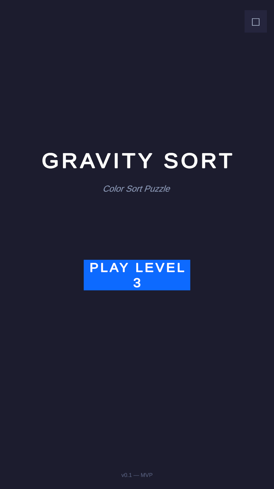
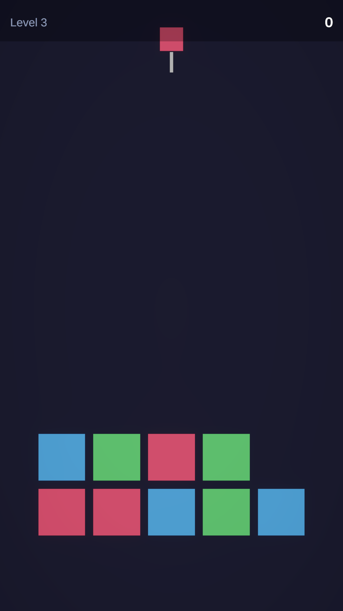
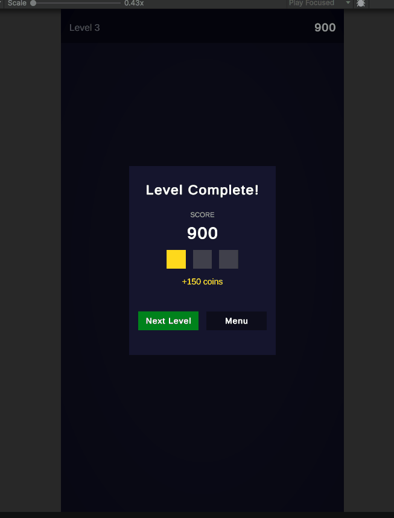

# Gravity Sort

> **Status: Pivoted** — Core loop reached playable state. Pivoted based on the GDD's own criteria. See [Why It Was Abandoned](#why-it-was-abandoned).

Color-sort puzzle meets falling blocks. Sort matching colored blocks into columns while new blocks drop from above on a timer. Think Water Sort + Tetris pressure.

---

## Screenshots

| Main Menu | Gameplay (Level 3) |
|---|---|
|  |  |

*Left: Main menu with highest-unlocked level shown on the Play button. Right: Level 3 in-game — 5 columns, 3 colors (Red / Blue / Green), HUD with level + score, next-drop preview indicator above the grid.*

### Walkthrough



---

## Why It Was Abandoned

The GDD included explicit pivot criteria. By the time the core loop was playable, all three failure conditions were met:

1. **Feels like Water Sort** — The core tap-A → tap-B pour interaction is identical. Gravity drops are an addition, not a transformation. Publishers and players make that association in 3 seconds.
2. **Drop timing has no good answer** — Fast drops kill strategy. Slow drops create dead time. There is no sweet spot because *passive waiting is not fun in a puzzle game*. This is structural, not tunable.
3. **No marketable hook** — A 3-second ad creative looks like Water Sort. CPI would be high competing against established titles with no visual differentiation.

The architecture and workflow carry over directly to the next project. Nothing built here was wasted.

---

## Tech Stack

| Item | Value |
|---|---|
| Engine | Unity 6 (6000.3.8f1), 2D URP |
| Input | New Input System |
| Animation | DOTween (all tweens — no Unity Animator) |
| UI Text | TextMesh Pro |
| Config | ScriptableObjects — no magic numbers in code |
| Save data | PlayerPrefs (JSON via `JsonUtility`) |
| Namespace | `GravitySort` on all scripts |

---

## Architecture

### Core Principle: Data ≠ Visuals

`GridManager` owns `List<int>[]` column data (color indices). `Block` MonoBehaviours are purely visual. Game state is never read from positions — always from the data arrays.

```
columnData[column][row] = colorIndex   ← source of truth
blockVisuals[column, row] = Block      ← display only
```

### Game State Machine (`GameManager`)

Singleton, `DontDestroyOnLoad`. All state transitions go through `ChangeState()` which validates against an allowed-transition table and fires `OnStateChanged` for subscribers.

```
Boot → MainMenu → LoadingLevel → Playing
                                    ↕
                               Pouring → ChainCheck → Clearing
                                    ↕         ↕
                               GameOver   LevelComplete
```

Input is locked during every non-`Playing` state via `InputHandler.inputEnabled`.

### Pour Flow

```
HandleColumnTapped
  → Select (first tap, non-empty column)
  → Deselect (same column again)
  → StartPour (different column, CanPour passes)
       1. inputEnabled = false
       2. blockDropper.PauseDrops()
       3. GameManager → Pouring
       4. GetTopColorGroupBlocks() [BEFORE data changes]
       5. ExecutePour() [data-only: RemoveBlocksFromTopDataOnly + AddBlockToColumnData]
       6. PourAnimator.AnimatePour() [DOJump arcs, staggered]
       7. callback → SettleColumn(source)
       8. GameManager → ChainCheck → ChainReactionHandler.StartChainCheck()
```

### Chain Reaction Loop (`ChainReactionHandler`)

Fully callback-driven, never blocks a frame.

```
StartChainCheck()
  → MatchChecker.CheckAllColumns()      // bottom-to-top scan, all columns
  → if matches found:
       comboCount++
       collect Block refs (before data changes)
       fire OnBlocksCleared
       PlayClearAnimation on each block
       → all anims done → RemoveBlocksAtRange → SettleAllColumns
       → DoCheckStep() again (loop)
  → if no matches:
       fire OnChainComplete(comboCount)
       → GameplayController re-enables input + resumes drops
```

### Block Drop System (`BlockDropper`)

- `Update()` counts down `dropInterval` only when `isActive && inputEnabled`
- Drop sequence is **pre-determined per level** (`LevelData.dropSequence`) — not random, guarantees solvability
- Fires `OnBlockDropped` after animation lands → `GameplayController` kicks `StartChainCheck`
- Fires `OnColumnOverflow` instead of dropping if target column is full → game over
- `PauseDrops / ResumeDrops / StopDrops` API for animation locks, boosters, and end states

### Match Checker (`MatchChecker`)

Scans each column bottom-to-top. Clears **multiples of `matchThreshold`** (default 3) so the color divisibility invariant holds even when drops stack more than 3 identical blocks.

```
groupCount = contiguous same-color blocks
clearCount = (groupCount / matchThreshold) * matchThreshold
if clearCount >= matchThreshold → MatchResult
```

### Object Pooling

`GridManager.InitGrid()` pre-instantiates `columns × maxRows` Block objects. `GetFromPool()` finds the first inactive one. `Block.ResetBlock()` kills tweens, resets scale/alpha, deactivates. No `Instantiate` or `Destroy` at runtime.

### Score System (`ScoreManager`)

Subscribes to `ChainReactionHandler` events. Points from GDD scoring table:

| Blocks cleared | Base points | Combo multiplier |
|---|---|---|
| 3 | 100 | ×1 (step 1) |
| 4 | 200 | ×2 (step 2) |
| 5+ | 350 | ×3 (step 3) |
| — | — | ×5 (step 4+) |

---

## Project Structure

```
Assets/_GravitySort/
├── Scripts/
│   ├── Core/
│   │   ├── GameManager.cs          — Singleton state machine, PlayerProgress
│   │   ├── LevelManager.cs         — Level loading, grid init, progression
│   │   └── SceneFlowController.cs  — Canvas visibility driven by OnStateChanged
│   ├── Gameplay/
│   │   ├── GridManager.cs          — Column data arrays, block pool, world positioning
│   │   ├── Block.cs                — Visual component, all DOTween animations
│   │   ├── InputHandler.cs         — New Input System tap → column index
│   │   ├── GameplayController.cs   — Selection, pour validation, win/lose check
│   │   ├── PourAnimator.cs         — Staggered DOJump arc animations
│   │   ├── MatchChecker.cs         — Vertical same-color group detection
│   │   ├── ChainReactionHandler.cs — Async clear → settle → recheck loop
│   │   ├── BlockDropper.cs         — Timed drops from LevelData.dropSequence
│   │   ├── ScoreManager.cs         — Points + combo multipliers
│   │   └── TestBootstrap.cs        — Temporary level loader (pre-LevelManager)
│   ├── UI/
│   │   ├── HudManager.cs           — Score + level label (TMP)
│   │   ├── MainMenu.cs             — Play button reads highestLevelUnlocked
│   │   ├── LevelCompletePopup.cs   — Panel-in anim, rolling score, 3-star rating
│   │   ├── GameOverPopup.cs        — Gem/ad continue, Try Again, Menu
│   │   ├── NextBlockPreview.cs     — World-space upcoming drop indicators
│   │   └── ColumnWarningVisual.cs  — Pulsing red overlay at danger height
│   ├── Data/
│   │   ├── GameConfig.cs           — ScriptableObject: all config values
│   │   ├── LevelData.cs            — ScriptableObject: StartingBlock[], DropEntry[]
│   │   └── PlayerProgress.cs       — JSON save/load via PlayerPrefs
│   └── Editor/
│       ├── LevelGenerator.cs       — Generates all 30 Level assets (menu item)
│       ├── LevelValidator.cs       — Validates color divisibility invariant
│       ├── SceneWirer.cs           — Auto-wires all scene SerializeField references
│       ├── BlockPrefabCreator.cs   — Creates Block.prefab via menu item
│       ├── GameConfigCreator.cs    — Creates GameConfig.asset via menu item
│       ├── HudUIBuilder.cs         — Builds HUD canvas hierarchy
│       ├── LevelCompleteUIBuilder.cs
│       ├── GameOverUIBuilder.cs
│       └── MainMenuUIBuilder.cs
├── ScriptableObjects/
│   ├── GameConfig.asset
│   └── Levels/
│       ├── Level_01.asset … Level_30.asset
│       ├── Level_Test.asset
│       └── Level_Test_Chain.asset
├── Prefabs/
│   └── Block.prefab
└── Sprites/
    └── block_white.png             — 32×32 px, PPU=32, tinted at runtime
```

---

## Level Design Rule (Divisibility Invariant)

For `ClearAll` win condition levels, total count of each color across `startingBlocks + dropSequence` must be divisible by `matchThreshold` (default 3). This mathematically guarantees every color can be fully cleared.

```
✓  6 Red + 3 Red drops  = 9 Red  (9 % 3 == 0)
✗  5 Red + 3 Red drops  = 8 Red  (8 % 3 != 0)
```

`LevelValidator.cs` (menu: **GravitySort → Validate All Levels**) checks this on every asset.

---

## What Carries Forward

The architectural patterns from this project are reusable as-is:

- **Event-driven state machine** — `OnStateChanged` + `ChangeState()` pattern scales to any game
- **Data / visual separation** — works for any grid-based game
- **Callback-driven animation chains** — DOTween + callbacks, no coroutines needed
- **ScriptableObject config** — zero magic numbers, live-tunable in Editor
- **Object pooling pattern** — `InitGrid` pre-alloc, `ResetBlock` return
- **Editor tooling** — auto-wiring, validators, generators save hours of manual Inspector work
- **Unity MCP workflow** — Claude Code + MCP for Unity for Editor automation
